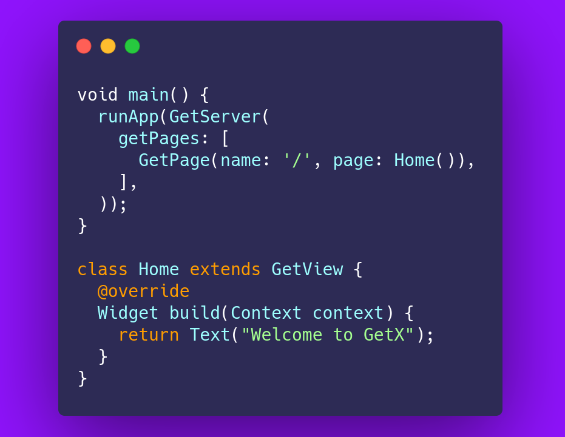

# Get Server

GetServer allows you to write backend applications with Flutter. Everything here is familiar, from the widgets, to the setState, initState and dispose methods, to the way you manage your projects with GetX using controllers and bindings. You don't need any additional knowledge to use GetServer, if you know Flutter, you can write your application's API using it.
GetServer gives you 100% reuse of code between backend and frontend.




Flutter has become increasingly popular, and as it grows, there is also a new need for a niche of developers who want to use the same Stack.
GetX for its ease and practicality has attracted many new developers every day, who started using Flutter to build mobile, desktop and also web applications. However, the GetX community has turned to a common need: the lack of a cohesive ecosystem for backend programming without a large learning curve.
The purpose of this project is to supply the needs of these developers, who can now build backend applications with a 0% learning curve. If you already program in another language, I invite you to test it, if you feel good, or mastered another language, maybe GetServer is not for you, but we are happy to bring ease to people's lives, so if you program mobile but you have no idea how to create an api, you may have found what you were looking for.
If you have a local database written in dart (like Hive and Sembast), you can turn it into a backend and build your api to provide them with a simple copy and paste.
All of your Model classes are reused.
All its route syntax is reused (if you use GetX)
All of your business logic is reused.

## Getting Started

 Installing

Add Get to your pubspec.yaml file:

run `dart create project` and add to your pubspec:

```yaml
dependencies:
  get_server:
```

Import get in files that it will be used:

```dart
import 'package:get_server/get_server.dart';
```

To create a server, and send a plain text:

```dart
void main() {
  runApp(
    GetServerApp(
      home: Home(),
    ),
  );
}

class Home extends StatelessWidget {
  @override
  Widget build(BuildContext context) {
    return Text('Welcome to GetX!');
  }
}
```
However, if you don't need to have a single page, you will need named routes to define your urls. This is stupidly simple, and identical to GetX routes for frontend

```dart
void main() {
  runApp(GetServerApp(
    getPages: [
      GetPage(name: '/', page:()=> Home()),
    ],
  ));
}

class Home extends StatelessWidget {
  @override
  Widget build(BuildContext context) {
    return Text("Welcome to GetX");
  }
}
```
you just define the path of your URL, and the page you want to deliver!

What if you want to return a json page?

```dart
class Home extends StatelessWidget {
  @override
  Widget build(BuildContext context) {
    return Json({
      "fruits": ["banana", "apple", "orange"]
    });
  }
}
```

Ok, you created your project with Flutter web, and you have no idea how to host it on a VPS, would it be possible to create the API for your application, and use the same GetX to display the Flutter web project?
Yep. You need only copy your web folder from Flutter project, and paste on directory 
from server file. 
Flutter web generates an html file that calls a js file, which in turn requests several files that must be in a public folder. To make the Flutter web folder a public folder, just add it to your GetServer. That way when you enter your server, you will automatically be directed to site made with Flutter.

```dart
void main() {
  runApp(
    GetServerApp(
      home: FolderWidget('web'),
      getPages: [
        GetPage(name: '/api', page: () => ApiPage()),
      ],
    ),
  );
}
```
- Note: Static folder only can be the root folder. It will replace any '/' route

If you have an html that does not call files from the server, but only external files, you can use the Html widget for a specific path.

```dart
class Home extends StatelessWidget {
  @override
  Widget build(BuildContext context) {
    final path = '${Directory.current.path}/web/index.html';
    return Html(path);
  }
}
```

Ok, but what if I want to do a POST method to send a photo to my server, for example, how do I do this?

Okay, that sounds crazy, but you upload the file to your server, and retrieve it with an "upload.data".
For the example not to be small, I will return a json response with the name of the file, his mimeType, and the same file back decoded in base64 so the example doesn't have just 5 lines.

```dart
class Home extends GetView {
  @override
  Widget build(BuildContext context) {
    return MultiPartWidget(
      builder: (context, upload) {
        return Json({
           "nameFile": upload.name,
           "mimeType": upload.mimeType,
           "fileBase64": "${base64Encode(upload.data)}",
        });
      },
    );
  }
}
```
How about Authentication? We have this as well.

First define a secret for your JWT:
```dart
void main() {
  runApp(
   GetServerApp(
    jwtKey: 'your key here',
   ),
  );
}
```
Second, retrieve your token:
```dart
final claimSet = JwtClaim(
  expiry: DateTime.now().add(Duration(days: 3)),
  issuer: 'get is awesome',
  issuedAt: DateTime.now(),
);

var token = TokenUtil.generateToken(claim: claimSet);
```
and finally just flag your routes that need the token to work:
```dart
GetPage(
  name: '/awesome-route',
  method: Method.get,
  page: () => YourPage(),
  needAuth: true,
),
```

I'm still not convinced, this is just an http server, but what if I want to create a chat that has real-time communication, how would I do that?

Okay, today is your lucky day. This is not just an http server, but also a websocket server.

```dart
class SocketPage extends GetView {
  @override
  Widget build(BuildContext context) {
     return Socket(builder: (socket) {
      socket.onOpen((ws) {
        ws.send('socket ${ws.id} connected');
      });

      socket.on('join', (val) {
        final join = socket.join(val);
        if (join) {
          socket.sendToRoom(val, 'socket: ${socket.hashCode} join to room');
        }
      });
      socket.onMessage((data) {
        print('data: $data');
        socket.send(data);
      });

      socket.onClose((close) {
        print('socket has closed. Reason: ${close.message}');
      });
    });
  }
}

```

Dart is not popular for servers, however, attracting people who already program in Flutter to the backend is now also a mission of GetX. Transforming one-dimensional programmers into full stack developers with 0% learning curve, and reusing code is also one of GetX's goals, and I hope you will help us on this journey.

### Like most of the "node.js" way?
The purpose of this package is to make development for Flutter developers easier. However, the javascript ecosystem is very large and you may be used to a more functional syntax.
With get_server you can use this path. You can use get_server as well:

```dart
import 'package:get_server/get_server.dart';
void main() {
  final app = GetServer();
  app.get('/', (ctx) => Text('Get_server of javascript way'));
  app.ws('/socket', (ws) {
    ws.onMessage((data) {
      print('data: $data');
    });

    ws.onOpen((ws) {
      print('new socket opened');
    });

    ws.onClose((ws) {
      print('socket has been closed');
    });
  });
}
```

### More Power  

If you host your Getserver on a cheap server with few cores, the default option is more than enough. However, if you have a server with many cores and want to make the most of it, you can start the multithreaded server with isolates. This requires only a small step.
Create a global function (isolated requirement), insert your runApp into it, and start it in `runIsolate`.

```dart
void main() {
  runIsolate(init);
}

void init(_) {
  runApp(
    GetServerApp(
      home: Home(),
    ),
  );
}
```
Note: This is a function that creates a thread for each CPU and you can use it throughout your application with GetServer. If you need activity with intense CPU and memory activity, you can use runIsolate.

### How can you help?
- Creating Pull requests, adding resources, improving documentation, creating sample applications, producing articles, videos about Getx, suggesting improvements, and helping to disseminate this framework in development communities.
- Supporting this project.

TODO:
- ~Add Auth options~
- ~Remove requirements dart:mirrors to allow people to compile the server and use only the binary, protecting its source code.~
- ~Creation of Bindings and Controllers (as in the main GetX) to adapt the project 100% with Getx for frontend.~
- Add some ORM


### Accessing GetX:

GetX starts by default on port 8080.
This was done to, if you want to install a reverse proxy like nginx, do it without much effort.

You could, for example, access the home page created in this example, using:

`http://localhost:8080/`
or 
`http://127.0.0.1:8080/`

However, if you want to start it on another port, such as 80, for example, you can simply do:

```dart
void main() {
  runApp(GetServer(
    port: 80,
    getPages: [
      GetPage(name: '/', page:()=> Home()),
    ],
  ));
}
```

To SSL you have too the `certificateChain`, `privateKey`, and `password`, configurations on GetServer
